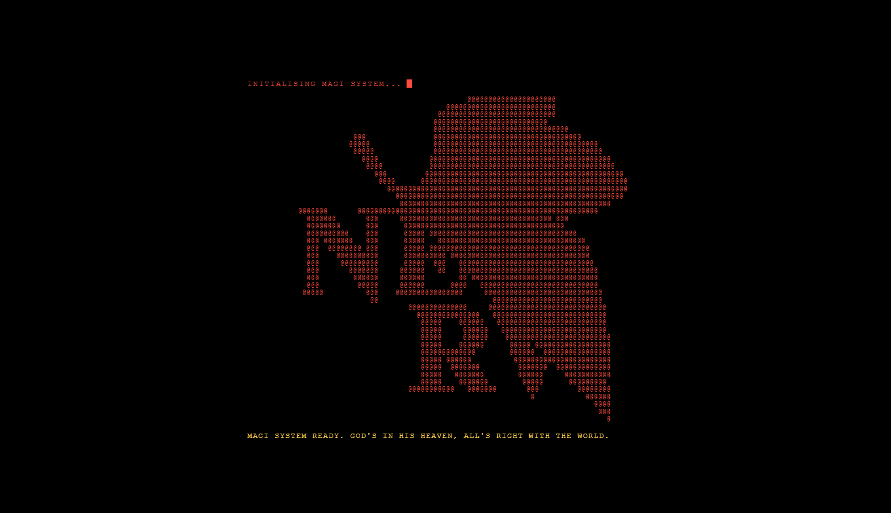
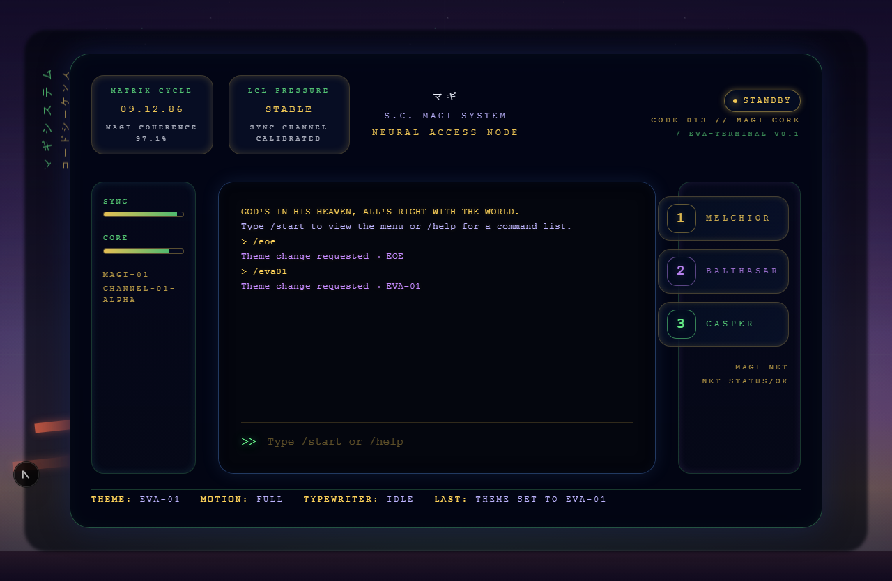
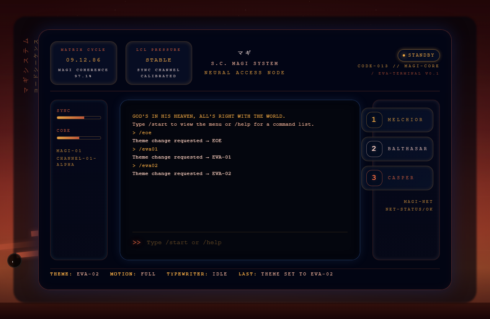
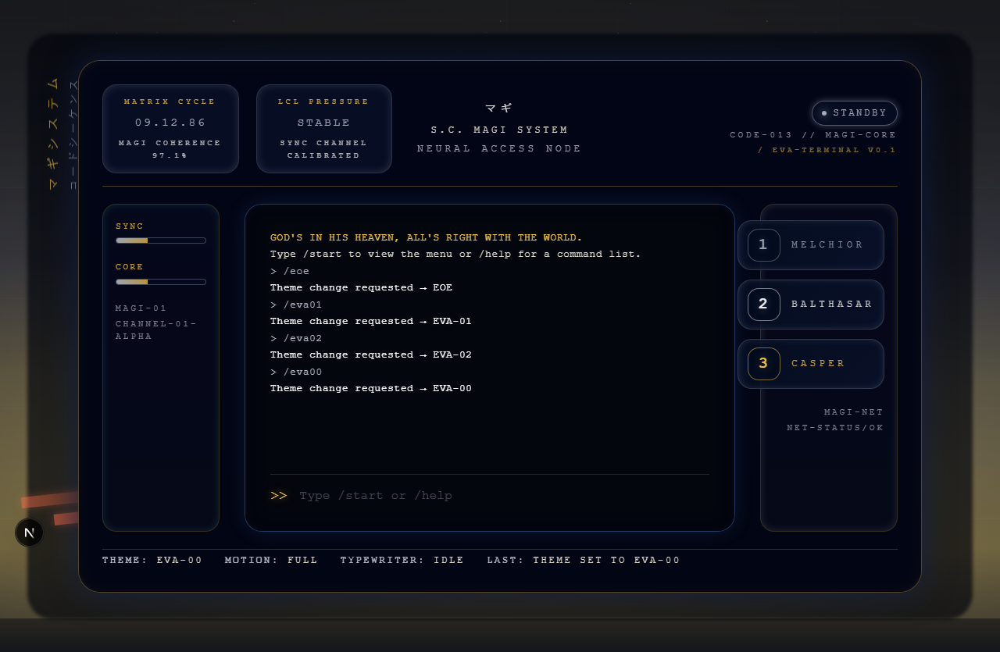
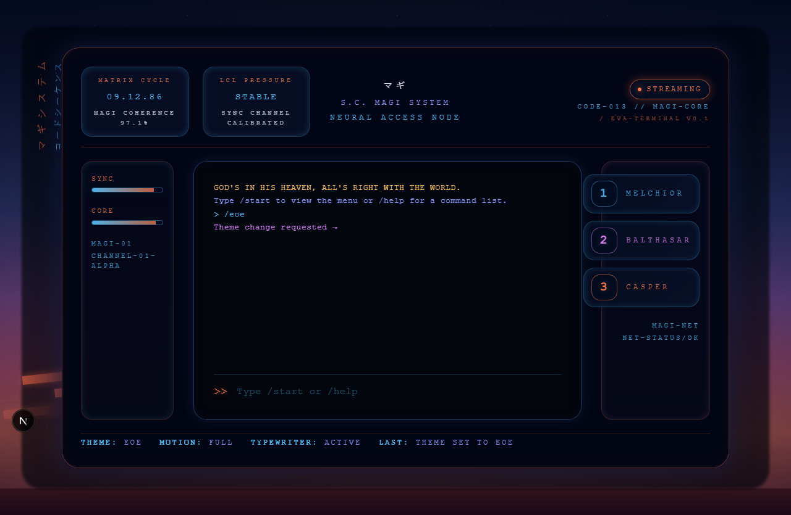

# EVA Terminal

A portfolio website inspired by Neon Genesis Evangelion's [MAGI supercomputer system](https://evangelion.fandom.com/wiki/Magi). Navigate via terminal commands, toggle between unit themes, and manage content through a built-in admin panel.



---

## ✨ Features

- **Terminal-style interface** — Type commands to navigate (try `start`, `/help`)
- **Four themes** — Switch with `/eva01`, `/eva02`, `/eva00`, or `/eoe` for an End of Evangelion theme
- **Accessible one-page summary view** — Type `/onepager` for a traditional summary without the terminal experience
- **Dedicated project & article readers** — users can visit /projects, /articles for long-form content
- **Admin panel** — Manage articles, projects, links, and more at `/admin`
- **Animated boot sequence** — NERV-inspired startup experience

---

## 🚀 Fork & Deploy in 5 Steps

### 1. Fork & Clone

```bash
git clone https://github.com/YOUR_USERNAME/eva-terminal.git
cd eva-terminal
npm install
```

### 2. Create a Supabase Project

1. Sign up at [supabase.com](https://supabase.com)
2. Create a new project
3. Go to **SQL Editor** and run the contents of `supabase/migrations/0001_master.sql`
4. Create storage buckets: `reel`, `cv`, `project-mdx`

### 3. Configure Environment

```bash
cp .env.example .env.local
```

Edit `.env.local` with your Supabase credentials:

```
NEXT_PUBLIC_SUPABASE_URL=https://your-project.supabase.co
NEXT_PUBLIC_SUPABASE_ANON_KEY=your-anon-key
NEXT_PUBLIC_SITE_URL=http://localhost:3000
```

> ⚠️ **Important**: Before running migrations, replace `admin@example.com` in the SQL file with your email. See "Customizing Admin Access" below.

### 4. Start Developing

```bash
npm run dev
```

Visit [localhost:3000](http://localhost:3000) — you should see the boot sequence!

### 5. Deploy

Works on **Vercel**, **Netlify**, or any Node.js host:

1. Push your fork to GitHub
2. Connect to your hosting platform
3. Add the same environment variables
4. Deploy!

---

## 🎨 Theme Gallery

<table>
<tr>
<td><br/><code>/eva01</code></td>
<td><br/><code>/eva02</code></td>
</tr>
<tr>
<td><br/><code>/eva00</code></td>
<td><br/><code>/eoe</code></td>
</tr>
</table>

---

## 🔐 Customizing Admin Access

Before running Supabase migrations, update the admin email:

```bash
# Find all occurrences
grep -n "admin@example.com" supabase/migrations/0001_master.sql

# Replace with your email
sed -i 's/admin@example.com/your-email@example.com/g' supabase/migrations/0001_master.sql

# Or use the helper script
./scripts/customize-admin-email.sh your-email@example.com
```

Then sign up in Supabase Auth with that email to access `/admin`.

---

## 🛠 Customizing Your Site

| What to change      | Where to find it                                |
| ------------------- | ----------------------------------------------- |
| Boot sequence text  | `src/features/terminal/lib/boot.ts`             |
| Terminal commands   | `src/features/terminal/lib/command-registry.ts` |
| Theme colors        | `src/lib/theme/theme-manifest.ts`               |
| Bio & contact info  | Admin panel at `/admin`                         |
| Articles & projects | Admin panel at `/admin`                         |

---

## 📚 Need More?

- **[CONTRIBUTING.md](CONTRIBUTING.md)** — Technical deep-dive, architecture, testing, and contribution guidelines
- **[docs/caching.md](docs/caching.md)** — Caching strategy and performance details
- **[LICENSE](LICENSE)** — MIT License

---

## 🐛 Issues & Questions

Found a bug? Have a question? [Open an issue](https://github.com/YOUR_USERNAME/eva-terminal/issues) — happy to help!

---

## 📄 License

MIT — Use freely, attribution appreciated. Please scrub personal data before publishing your fork.
